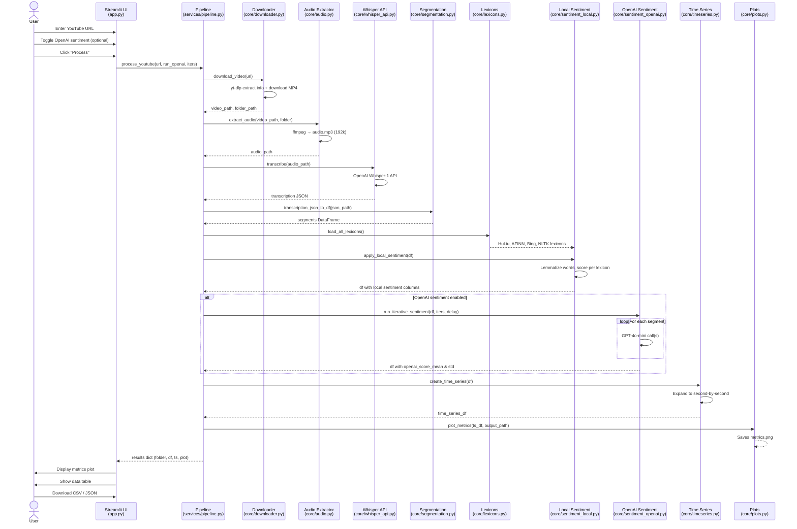

# YouTube Multimodal Sentiment Analysis

A Streamlit-based pipeline that downloads YouTube videos, transcribes speech via OpenAI Whisper, performs lexicon-based and AI-powered sentiment analysis, and produces time-series visualizations.

---

## Architecture Overview

```mermaid
graph TB
    subgraph "User Interface"
        UI[Streamlit App<br/>app.py]
        P2[Standalone Transcription<br/>pages/2_Generate_Transcription.py]
    end

    subgraph "Pipeline Orchestration"
        PO[services/pipeline.py<br/>process_youtube()]
    end

    subgraph "Data Ingestion"
        DL[core/downloader.py<br/>download_video]
        AU[core/audio.py<br/>extract_audio]
    end

    subgraph "Transcription"
        WA[core/whisper_api.py<br/>transcribe]
        SG[core/segmentation.py<br/>transcription_json_to_df]
    end

    subgraph "Sentiment Analysis"
        SL[core/sentiment_local.py<br/>apply_local_sentiment]
        SO[core/sentiment_openai.py<br/>run_iterative_sentiment]
        LX[core/lexicons.py<br/>load_all_lexicons]
    end

    subgraph "Post-Processing"
        TS[core/timeseries.py<br/>create_time_series]
        PL[core/plots.py<br/>plot_metrics]
        UT[core/utils.py<br/>make_dir, save_json]
    end

    subgraph "Alternative Transcribers"
        TG[core/transcriber_google.py]
        TD[core/transcriber_deepgram.py]
        TW[core/transcriber_whisper_local.py]
    end

    subgraph "Output"
        CSV[transcription_result.csv]
        JSON[transcription_result_records.json]
        PNG[metrics.png]
    end

    UI --> PO
    P2 --> TG
    P2 --> WA
    P2 --> TW

    PO --> DL
    DL --> AU
    AU --> WA
    WA --> SG
    SG --> SL
    SL --> LX
    SL --> SO
    SO --> TS
    TS --> PL
    PL --> PNG
    TS --> CSV
    TS --> JSON
    UT -.-> DL
    UT -.-> WA
```

---

## Pipeline Data Flow



---

## Module Reference

### `app.py`
Main Streamlit entry point. Accepts a YouTube URL, configurable iteration count for OpenAI sentiment, and triggers the full pipeline. Displays the sentiment time-series plot and tabular results with CSV/JSON download buttons.

### `services/pipeline.py`
Orchestrator function `process_youtube(url, run_openai_sentiment, openai_iters)` that chains all core modules sequentially. Returns a dictionary containing `folder` path, `df` (segment-level DataFrame), `time_series` (second-by-second DataFrame), and `plot_path`.

### `core/downloader.py`
Uses `yt-dlp` to extract video metadata and download the MP4. Creates an output folder under `public/packages/<sanitized_title>/` with a `video_info.json` metadata file.

### `core/audio.py`
Uses `ffmpeg-python` to extract 192kbps MP3 audio from the downloaded video for transcription.

### `core/whisper_api.py`
Calls OpenAI's Whisper-1 API (`client.audio.transcriptions.create`) with `response_format="verbose_json"` to obtain word-level transcription with timestamps. Saves raw output as `transcription.json`.

### `core/segmentation.py`
Parses the Whisper verbose JSON segments array into a pandas DataFrame with columns: `segment_id`, `start`, `end`, `text`, `tokens`, `segment_avg_logprob`, `segment_compression_ratio`, `segment_no_speech_prob`.

### `core/lexicons.py`
Loads four sentiment lexicons from remote sources, lemmatizes all words via `WordNetLemmatizer`, and returns a unified DataFrame:
- **HuLiu** — positive/negative opinion words from Bing Liu's lexicon
- **AFINN** — words with integer sentiment scores (-5 to +5)
- **Bing** — positive/negative word list (may be unavailable)
- **NLTK Opinion** — built-in NLTK opinion lexicon corpus

### `core/sentiment_local.py`
For each segment's text, lemmatizes tokens and computes per-lexicon: positive word fraction, negative word fraction, and net score `(positive - negative) / total_words`. Appends 12 columns (`<lexicon>_positive`, `<lexicon>_negative`, `<lexicon>_net` for each of the 4 lexicons).

### `core/sentiment_openai.py`
Optionally calls GPT-4o-mini iteratively for each segment (configurable iterations, default 3). The model returns a JSON `{"sentiment_score": N}` where N is 1-10. Averages the iterations to produce `openai_score_mean` and `openai_score_std`.

### `core/timeseries.py`
Expands segment-level data into a second-by-second time series. For each integer second spanned by a segment, all numeric sentiment columns (matching `positive`, `negative`, `net`, `openai`) are copied.

### `core/plots.py`
Generates a multi-line time-series plot using Matplotlib and Seaborn showing all sentiment metrics over time. Saves the figure as `metrics.png`.

### `core/utils.py`
Helper utilities: `make_dir(path)` creates directories recursively; `save_json(data, path)` writes JSON with UTF-8 encoding.

### Alternative Transcribers

| Module | Engine | Notes |
|---|---|---|
| `core/transcriber_google.py` | Google Speech Recognition (free) | Splits audio into 50s chunks, 16kHz mono WAV. Wired into Page 2 only. |
| `core/transcriber_deepgram.py` | Deepgram API | Splits words into segments by 1s gaps. Not wired into main pipeline. |
| `core/transcriber_whisper_local.py` | faster-whisper (large-v3, CPU, int8) | Stub implementation. Not wired into main pipeline. |

---

## Setup

### 1. Install dependencies

```bash
pip install -r requirements.txt
```

### 2. Configure API keys

Create `.streamlit/secrets.toml`:

```toml
OPENAI_API_KEY = "sk-..."
```

Required for Whisper transcription and optional GPT sentiment scoring.

### 3. Run the app

```bash
streamlit run app.py
```

---

## Output Structure

```
public/packages/<video_title>/
├── video_info.json              # yt-dlp video metadata
├── audio.mp3                    # Extracted audio (192k MP3)
├── transcription.json           # Raw Whisper API response
├── transcription_result.csv     # Segment-level sentiment data
├── transcription_result_records.json  # Second-by-second time series
└── metrics.png                  # Sentiment time-series plot
```

---

## Configuration

| Parameter | Default | Description |
|---|---|---|
| OpenAI iterations | 3 | Repeated GPT-4o-mini calls per segment for robust scoring |
| Audio bitrate | 192k | MP3 encoding bitrate via ffmpeg |
| Whisper model | whisper-1 | OpenAI's Whisper API model |
| GPT model | gpt-4o-mini | OpenAI chat model for sentiment scoring |

---

## Known Issues

- **API key exposure**: `.gitignore` has a malformed entry that does not properly exclude `secrets.toml`.
- **Missing API key crashes**: `whisper_api.py` raises at import time if no key is found.
- **Bing lexicon fragility**: The Bing lexicon URL may change; the loader silently returns empty on failure.
- **Alternative transcribers**: Deepgram and faster-whisper backends are not integrated into the main pipeline.
